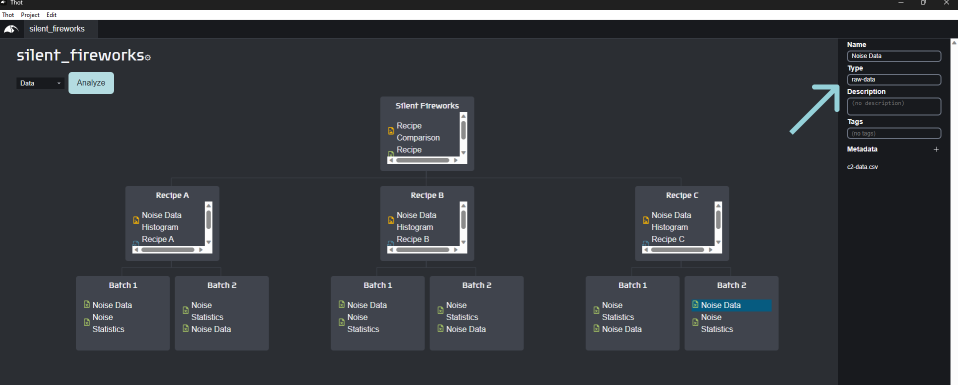

# Advanced tutorial | Puzzle's Fireworks
> :clock9: **10 minutes**

> **Note**
> This project depends on the [intermediate fireworks tutorial project](/beginner/fireworks).
> If you don't have it, you can [download it](/intermediate/fireworks#adjusting-workflows) at the bottom of that tutorial.

## Cleaning up our data
Our engineers got back to us regarding the outlier in our data.
It turns out that the equipment they used can only measure down to 70 dB, so we
can remove any measurements below that as an error.
Let's create a new analysis script to handle this.

### Reorganizing data
We only have a problem in Recipe C > Batch 2, so we'll start by restricting our changes to that Container.
We'll first adjust our noise data in Recipe C > Batch 2 by changing the `type` to **raw-data**.

This script will search for an Asset of `type` **raw-data**, clean it, and create a new Asset of `type` **noise-data**.
This processed noise data will then flow through the rest of the work flow as normal.



Create a new project script called `clean_noise_data` with the contents below, and associate it with the Recipe C > Batch 2 Container.
<details>
<summary>Python</summary>

```python
# import libraries
import pandas as pd
import thot

# initialize thot database
db = thot.Database(dev_root="/absolute/path/to/silent_fireworks/data/Recipe C/Batch 2")

# get data
noise_data = db.find_asset(type="raw-data")
df = pd.read_csv(noise_data.file, index_col=0);

# remove invalid data
clean_df = df[df > 70].dropna()

# save cleaned data
data_path = db.add_asset(
    "noise_data-cleaned.csv",
    name="Noise Data - Cleaned",
    type="noise_data",
    tags=["cleaned"] # tag the data as cleaned for future reference
)

clean_df.to_csv(data_path)
```
</details>
<details>
<summary>R</summary>

```R

```
</details>

But how do we tell Thot that the `noise_stats` Script needs to run after the `clean_noise_data` Script?

### Analysis dependencies
We can stack our analysis scripts like legos by using the **order** parameter. Within a Container, Scripts run from lowest order to highest (e.g. 0 then 1 then 2). Scripts with the same order run in parallel, and all scripts with a certain order will complete before moving to the next.

Set the `clean_noise_data` Script's order to **1**.


This allows us to keep our Scripts small and reuse them across projects.

Before we analyze the project, we can save ourselves some time by telling Thot not to run analyses we know haven't changed.
Select all the Recipe A and Recipe B Containers -- the Recipe and Batch Containers -- and uncheck the **autorun** boxes in the Scripts section.
You can see which Scripts will run on the Containers by setting the preview to **Scripts** and checking the star icon.


Analyze the project, and look at the results.

## Buckets
With all these caveats in our data, let's create some more advanced plots so we can really evaluate what is going on.

Create a new script called `adv_recipe_stats` and add it to your project with the following contents

<details>
<summary>Python</summary>

```python
import pandas as pd
import thot

db = thot.Database(dev_root="/absolute/path/to/fireworks/data/Container A")

noise_data = db.find_assets(type="noise-data")

```
</details>
<details>
<summary>R</summary>

```R

```
</details>

