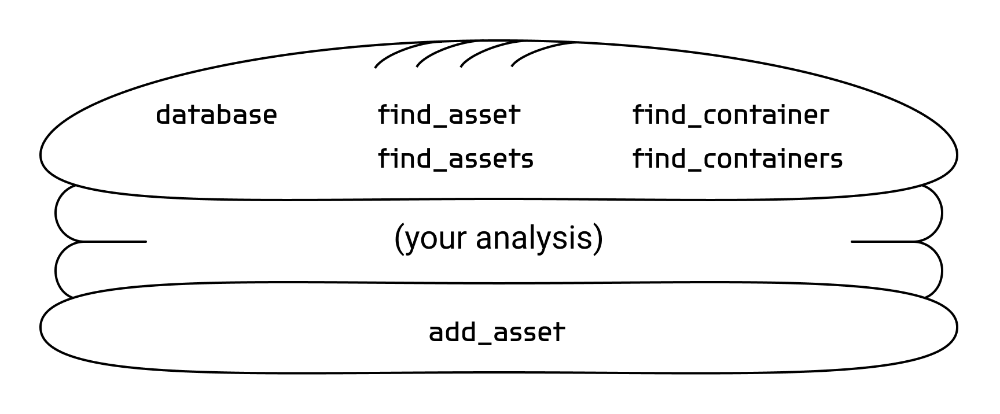

# API
> :clock9: **5 minutes**

Thot's API is available for
+ [Python](python)
+ [R](r)

If your favorite language isn't yet supported let us know either on our [Discord](https://discord.gg/Kv2c5XynfV) or by email at <info@thot.so>.

Below is an overview of Thot's API. For more details and examples, visit your language's docs.

## Sandwich model
Thot uses a sandwich model to allow you to interact with your projects, where Thot is the bread and your analysis is the meat.
This allows you to easily adapt scripts you've already created to Thot, or take Thot scripts and use them outside the framework.



## Initializing a database
The first thing to do in any project is initialize the database. This gives you access to your project.
If you want to interact with your project manually, assign the `dev_root` parameter to the absolute path of the Container you want to interact with. When Thot is analyzing a project, the `dev_root` is ignored.

## Getting resources
Thot exposes four methods to get project resources.
+ **`find_asset` / `find_container`:** Finds a single Asset/Container matching the provided filter, returning the languages `None` type if no matches are found.
If multiple resources are found, a random one is returned.
+ **`find_assets` / `find_containers`:** Finds multiple Assets/Containers, returning them as the language's `list` type.

Each of these functions accepts filter parameters that correspond to the properties you can assign them in the details bar of the desktop app
+ name  (`string` | `None`)
+ type (`string` | `None`)
+ tags (`list`)
+ metadata (`dictionary`)

A resource must match all of the provided filter parameters.

### Hierarchical database
Thot projects act as a [**hierarchical database**](https://en.wikipedia.org/wiki/Hierarchical_database_model). This means that each subtree has an isolated environment to operate in. When an analysis script is running over a certain container, it has access to everything in that Container and its subtree, but nothing outside of that.


## Adding Assets
To add a new Asset to your project, use the **`add_asset`** method.
This takes the file name to use for the Asset and each of properties you want to assign to it.

### Buckets
If you give the file name as a relative path, e.g. `bucket/my_data.png`, Thot will create subfolders matching the path to store the file in. These subfolders are used to organize Assets without creating new Containers, and are called **buckets**.

## Dev Mode
You can perform certain tasks in a script only when you are interacting with it manually.
Think of these as debug statements that are ignored when you are actually analyzing your project.
This is done with the **`dev_mode`** method, which returns `true` when you manually running the script, and `false` when the script is being run by Thot.

## Filtering resources
You can filter resources you've already collected using the **`filter`** method. This takes in a list of resources and filter parameters, and returns a new list containing only those that match.

## Example
This example is in Python-like pseudocode. For examples in your preferred language, [visit the docs for it](#api).

```python
import thot

# initialize database
db = thot.Database(dev_root="/absolute/path/to/my/project/data/container")

# get a container with name `Child 1`
child_one = db.find_container(name="Child 1")
if thot.dev_mode:
    print(child_one.type)

# get assets with type `raw_data`
raw_assets = db.find_assets(type="raw_data")

# read data from asset files
raw_data = []
for asset in raw_assets:
    raw_data = read_data(asset.file)
    data.append((raw_data, asset.metadata))

# ----------------
# --- ANALYSIS ---
# ----------------
analyzed_data = analyze_data(raw_data)

# create new asset for analyzed data and save to file
analyzed_data_path = db.add_asset(
    name="Analyzed data",
    type="analyzed_data",
    metadata={
        "str_metadata": "my_string_value",
        "num_metadata": 0,
        "bool_metadata": true
    }
)

analyzed_data.save_to_file(analyzed_data_path)
```
